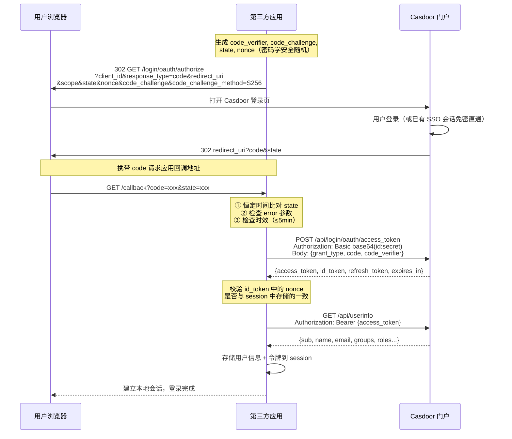

# Casdoor SSO OAuth 2.0 单点登录 API 对接文档

> **版本**：v2.2  
> **适用对象**：AI 编码智能体 / 第三方应用开发者  
> **协议**：OAuth 2.0 Authorization Code Flow + PKCE / OpenID Connect 1.0  
> **授权门户**：`https://portal.msuncloud.cn`  
> **最后更新**：2026-09-01

---

## ⚡ Quick-Start（AI 智能体直接复制使用）

> **本节专为 AI 编码智能体设计**——提供最小可运行流程，无需阅读全文即可生成对接代码。

### 变量约定

以下变量贯穿全文，所有代码示例均使用这些占位符，AI 智能体生成代码时应统一替换：

| 变量名 | 类型 | 示例值 | 说明 |
|---|---|---|---|
| `CASDOOR_ENDPOINT` | string | `https://portal.msuncloud.cn` | Casdoor 服务地址（固定值） |
| `CASDOOR_LOGIN_URL` | string | `https://portal.msuncloud.cn/login/zymsunsoft` | 用户登录页入口（固定值） |
| `CLIENT_ID` | string | `a1b2c3d4e5f6g7h8i9j0` | Casdoor 应用 Client ID |
| `CLIENT_SECRET` | string | `your_client_secret_here` | Casdoor 应用 Client Secret（仅服务端使用） |
| `REDIRECT_URI` | string | `https://your-app.com/callback` | 应用回调地址（须与 Casdoor 后台配置完全一致） |

### 4 步完成对接（授权码 + PKCE + state + nonce）

```
步骤 1 — GET  https://portal.msuncloud.cn/login/oauth/authorize
              ?client_id={CLIENT_ID}
              &response_type=code
              &redirect_uri={REDIRECT_URI}
              &scope=openid+profile+email
              &state={RANDOM_32_CHARS}
              &nonce={RANDOM_32_CHARS}
              &code_challenge={BASE64URL(SHA256(code_verifier))}
              &code_challenge_method=S256

步骤 2 — 解析回调  ?code={CODE}&state={STATE}
              → 校验 state（恒定时间比对）
              → 提取 code

步骤 3 — POST https://portal.msuncloud.cn/api/login/oauth/access_token
              Content-Type: application/json
              Authorization: Basic base64({CLIENT_ID}:{CLIENT_SECRET})  # 机密客户端
              Body: {"grant_type":"authorization_code","code":"{CODE}","code_verifier":"{VERIFIER}"}
              # 公开客户端（SPA/移动）：省略 Authorization 头，Body 中加 "client_id":"{CLIENT_ID}"

步骤 4 — GET  https://portal.msuncloud.cn/api/userinfo
              Authorization: Bearer {access_token}
              → 返回用户信息 JSON
```

### 令牌响应结构（固定 Schema）

```json
{
  "access_token":  "string (JWT)",
  "id_token":      "string (JWT，值与 access_token 相同)",
  "refresh_token": "string (JWT)",
  "token_type":    "Bearer",
  "expires_in":    604800,
  "scope":         "openid profile email"
}
```

### 用户信息响应结构（固定 Schema）

```json
{
  "sub":                "string (用户唯一标识)",
  "iss":                "https://portal.msuncloud.cn",
  "aud":                "{CLIENT_ID}",
  "preferred_username": "string",
  "name":               "string (显示名)",
  "email":              "string",
  "email_verified":     true,
  "picture":            "string (URL)",
  "phone":              "string",
  "address":            "string",
  "groups":             ["string"],
  "roles":              ["string"],
  "permissions":        ["string"]
}
```

### 错误响应结构（固定 Schema）

```json
{
  "error":             "invalid_grant",
  "error_description": "authorization code has expired"
}
```

> **AI 编码指令**：
> 1. 所有客户端（含机密客户端）**必须**使用 PKCE + state + nonce
> 2. 令牌端点**统一使用** JSON Body；机密客户端加 HTTP Basic Auth，公开客户端（SPA/移动）仅在 Body 中传 `client_id`
> 3. UserInfo 端点**统一使用** `Authorization: Bearer {token}` 请求头，不要使用 query 参数
> 4. `state`/`nonce` 比对**必须**使用恒定时间比较函数
> 5. `refresh_token` **必须安全存储**（Casdoor 刷新端点不验证 client_secret，安全性依赖令牌轮换）
> 6. 代码示例请参考第 6 节，按语言选择对应实现

---

## 1. 概述

### 1.1 什么是 Casdoor SSO

Casdoor 是基于 OAuth 2.0 / OIDC 协议的统一身份认证与授权平台。第三方应用通过标准 OAuth 2.0 **授权码模式（Authorization Code Flow）** 接入后：

- 用户在 Casdoor 门户登录**一次**，即可访问所有已接入应用（单点登录）
- 应用无需管理用户密码，通过 OAuth 令牌获取用户身份
- 支持 PKCE 扩展，安全适配 SPA、移动端等公开客户端

### 1.2 认证流程概览

```
┌──────────┐       ┌──────────────┐       ┌──────────────────────┐
│ 用户浏览器 │       │  第三方应用    │       │ Casdoor 门户          │
│          │       │              │       │ portal.msuncloud.cn  │
└────┬─────┘       └──────┬───────┘       └──────────┬───────────┘
     │  1.访问受保护资源    │                          │
     ├───────────────────►│                          │
     │                    │  2.生成 state/PKCE        │
     │  3.302 重定向到授权端点                         │
     │◄───────────────────┤                          │
     │  4.打开 Casdoor 登录页                         │
     ├──────────────────────────────────────────────►│
     │  5.用户输入凭证登录（或已有 SSO 会话免密直通）     │
     ├──────────────────────────────────────────────►│
     │                    │  6.302 回调 ?code&state   │
     │◄──────────────────────────────────────────────┤
     │  7.携带 code 请求回调地址                       │
     ├───────────────────►│                          │
     │                    │  8.POST code 换 token     │
     │                    ├─────────────────────────►│
     │                    │  9.返回 access_token      │
     │                    │◄─────────────────────────┤
     │                    │  10.GET /api/userinfo     │
     │                    ├─────────────────────────►│
     │                    │  11.返回用户信息           │
     │                    │◄─────────────────────────┤
     │  12.建立本地会话    │                          │
     │◄───────────────────┤                          │
```

### 1.3 OIDC Discovery（自动发现端点）

Casdoor 遵循 OIDC Discovery 规范，第三方应用可通过以下端点自动获取所有 OAuth 端点地址：

```http
GET https://portal.msuncloud.cn/.well-known/openid-configuration
```

响应示例（关键端点）：

```json
{
  "issuer": "https://portal.msuncloud.cn",
  "authorization_endpoint": "https://portal.msuncloud.cn/login/oauth/authorize",
  "token_endpoint": "https://portal.msuncloud.cn/api/login/oauth/access_token",
  "userinfo_endpoint": "https://portal.msuncloud.cn/api/userinfo",
  "end_session_endpoint": "https://portal.msuncloud.cn/api/logout",
  "introspection_endpoint": "https://portal.msuncloud.cn/api/login/oauth/introspect",
  "jwks_uri": "https://portal.msuncloud.cn/.well-known/jwks",
  "response_types_supported": ["code", "token", "id_token", "code token", "code id_token", "token id_token", "code token id_token"],
  "grant_types_supported": ["authorization_code", "implicit", "password", "client_credentials", "refresh_token", "urn:ietf:params:oauth:grant-type:device_code"],
  "scopes_supported": ["openid", "email", "profile", "address", "phone", "offline_access"],
  "code_challenge_methods_supported": ["S256"],
  "id_token_signing_alg_values_supported": ["RS256", "RS512", "ES256", "ES384", "ES512"]
}
```

> **AI 编码提示**：优先调用 Discovery 端点动态获取端点地址，而非硬编码。这使得应用在 Casdoor 地址变更时仍能正常工作。

---

## 2. 前置准备

### 2.1 Casdoor 管理后台配置

在 Casdoor 管理后台创建应用并获取凭证：

| 配置项 | 说明 | 示例值 |
|---|---|---|
| **Client ID** | 应用唯一标识，创建后自动生成 | `a1b2c3d4e5f6g7h8i9j0` |
| **Client Secret** | 应用密钥，**仅服务端使用**，禁止下发给前端 | `your_client_secret_here` |
| **Redirect URIs** | 回调地址白名单，须与授权请求中的 `redirect_uri` **完全一致** | `https://your-app.com/callback` |
| **Grant Types** | 勾选 `authorization_code`（必选）、`refresh_token`（推荐） | — |
| **Token Expire Hours** | access_token 有效期（小时），默认 168（7 天） | `168` |
| **Token Format** | JWT 令牌格式，推荐 `JWT-Standard`（标准 OIDC claims） | `JWT-Standard` |
| **Enable Auto Signin** | 开启后，已登录 Casdoor 的用户访问授权端点**直接免密下发 code** | `true` |

### 2.2 第三方应用需准备的参数

| 参数 | 来源 | 用途 |
|---|---|---|
| `CLIENT_ID` | Casdoor 管理后台 → 应用编辑页 | 标识应用身份 |
| `CLIENT_SECRET` | Casdoor 管理后台 → 应用编辑页 | 服务端认证密钥 |
| `REDIRECT_URI` | 自行定义，须与后台配置一致 | OAuth 回调地址 |
| `CASDOOR_ENDPOINT` | 固定值 | `https://portal.msuncloud.cn` |
| `CASDOOR_LOGIN_URL` | 固定值 | `https://portal.msuncloud.cn/login/zymsunsoft` |

### 2.3 端点总览

| 端点 | 方法 | URL | 说明 |
|---|---|---|---|
| 授权端点 | GET | `https://portal.msuncloud.cn/login/oauth/authorize` | 浏览器重定向（用户登录页） |
| 令牌端点 | POST | `https://portal.msuncloud.cn/api/login/oauth/access_token` | 授权码换令牌 |
| 刷新令牌 | POST | `https://portal.msuncloud.cn/api/login/oauth/refresh_token` | 刷新 access_token |
| 用户信息 | GET | `https://portal.msuncloud.cn/api/userinfo` | 获取当前用户身份 |
| 令牌内省 | POST | `https://portal.msuncloud.cn/api/login/oauth/introspect` | 服务端校验令牌有效性 |
| 登出（清会话） | GET/POST | `https://portal.msuncloud.cn/api/logout` | 仅清 IdP 会话返回 JSON，**不做浏览器回跳**（见 3.7 勘误） |
| 登出（浏览器回跳） | GET | `https://portal.msuncloud.cn/cas/{owner}/{app}/logout?service=<回跳地址>` | CAS 风格登出页，`service` 承载回跳地址（实测可用，见 3.7 勘误） |
| OIDC 发现 | GET | `https://portal.msuncloud.cn/.well-known/openid-configuration` | 自动发现端点 |
| JWKS 公钥 | GET | `https://portal.msuncloud.cn/.well-known/jwks` | JWT 本地验签公钥集 |
| OAuth 元数据 | GET | `https://portal.msuncloud.cn/.well-known/oauth-authorization-server` | RFC 8414 服务器元数据 |

---

## 3. API 接口规范

### 3.1 步骤一：重定向用户到授权端点

**请求**

```http
GET https://portal.msuncloud.cn/login/oauth/authorize
```

**Query 参数**

| 参数 | 类型 | 必填 | 安全等级 | 说明 |
|---|---|---|---|---|
| `client_id` | string | 是 | — | 应用的 Client ID |
| `response_type` | string | 是 | — | 固定填 `code`（**禁止使用 `token`/`id_token` 隐式流**，已被 OAuth 2.1 弃用） |
| `redirect_uri` | string | 是 | **关键** | URL 编码后的回调地址，须与后台配置**完全一致**（含协议、域名、端口、路径、大小写、末尾斜杠） |
| `scope` | string | 是 | 推荐 | 空格分隔的权限列表：`openid profile email`。**必须包含 `openid`**，遵循最小权限原则 |
| `state` | string | **必须** | **关键** | ≥32 字符的**密码学安全随机串**（防 CSRF），回调时原样返回，应用**必须校验**。使用 `crypto.randomBytes(32).toString('hex')` 或等效方式生成 |
| `nonce` | string | **必须** | **关键** | ≥32 字符随机串，写入 id_token 的 `nonce` claim，**必须校验**以防止令牌重放攻击 |
| `code_challenge` | string | **必须** | **关键** | PKCE challenge 值。**所有客户端（含机密客户端）均强烈建议启用** |
| `code_challenge_method` | string | **必须** | **关键** | 固定 `S256`（Casdoor 仅支持 S256，不支持 plain） |

> **⚠ 安全强制要求**：`state` + `nonce` + `code_challenge` 三项为安全必传参数。缺少任一项将导致以下风险：
> - 无 `state` → CSRF 攻击（攻击者可诱导用户登录攻击者控制的账户）
> - 无 `nonce` → 令牌重放攻击（攻击者可重放已截获的 id_token）
> - 无 `code_challenge` → 授权码拦截攻击（中间人可在回调途中截获授权码）

**完整请求示例（所有参数均为安全合规值）**

```
https://portal.msuncloud.cn/login/oauth/authorize?client_id={CLIENT_ID}&response_type=code&redirect_uri=https%3A%2F%2Fyour-app.com%2Fcallback&scope=openid+profile+email&state=7f3a9b2c8d1e4f5a6b7c8d9e0f1a2b3c&nonce=a1b2c3d4e5f6a7b8c9d0e1f2a3b4c5d6&code_challenge=E9Melhoa2OwvFrEMTJguCHaoeK1t8URWbuGJSstw-cM&code_challenge_method=S256
```

> **AI 智能体注意**：`state` 和 `nonce` 必须使用密码学安全随机生成器产生 ≥32 字符的随机串，禁止使用硬编码示例值。

**用户登录重定向地址 vs 授权端点**

Casdoor 提供两个不同的入口，用途不同，**请勿混淆**：

| 地址 | 用途 | 调用方 |
|---|---|---|
| `/login/oauth/authorize` | **标准 OAuth 授权端点**，携带 OAuth 参数，完成授权码流程 | 应用服务端发起 302 重定向 |
| `/login/zymsunsoft` | **门户登录页 UI 入口**，仅供用户手动登录，不带 OAuth 参数 | 用户点击“登录”按钮跳转 |

应用应始终通过 `/login/oauth/authorize` 发起 OAuth 流程。`/login/zymsunsoft` 仅用于非 OAuth 场景的直接登录引导。

**响应**

用户在 Casdoor 完成认证后（已有 SSO 会话则免密直通），浏览器被 302 重定向回：

```http
HTTP/1.1 302 Found
Location: https://your-app.com/callback?code=AUTH_CODE_HERE&state={STATE}
```

| 回调参数 | 说明 |
|---|---|
| `code` | 授权码，**有效期 5 分钟，且只能使用一次** |
| `state` | 与请求时一致的 state 值（即 `{STATE}`） |

**错误回调**

```
https://your-app.com/callback?error=invalid_scope&error_description=scope+is+not+valid&state={STATE}
```

### 3.2 步骤二：处理授权回调（安全校验清单）

应用回调接口**必须**按以下顺序执行全部校验：

```
1. ✅ 校验 state：与发起请求时 session 中存储的值进行恒定时间比对（防 timing attack）
2. ✅ 检查 error：如存在则记录并安全处理授权拒绝/失败
3. ✅ 校验 nonce：从 session 中取出，后续验证 id_token 中的 nonce claim 是否一致
4. ✅ 提取 code：授权码 5 分钟有效且一次性使用，必须立即换取令牌
5. ✅ 设置时效限制：授权码换取令牌的操作应在收到 code 后 **5 分钟内**完成（授权码有效期 5 分钟）
```

> **⚠ 关键安全约束**：
> - `state` 比对必须使用**恒定时间比较函数**（如 Python `hmac.compare_digest()`、Java `MessageDigest.isEqual()`、Node.js `crypto.timingSafeEqual()`），防止 timing side-channel 攻击
> - `state` 和 `nonce` 使用后**必须从 session 中删除**，防止重放
> - 回调接口必须设置 `Cache-Control: no-store` 响应头

### 3.3 步骤三：用授权码换取令牌

> **统一规范**：令牌端点**统一使用 JSON Body + HTTP Basic Auth**，禁止使用 form-urlencoded 或 query 传参（避免 secret 出现在 URL 日志中）。

**请求**

```http
POST https://portal.msuncloud.cn/api/login/oauth/access_token
Content-Type: application/json
Authorization: Basic base64({CLIENT_ID}:{CLIENT_SECRET})
```

**请求 Body（JSON）**

| 字段 | 类型 | 必填 | 说明 |
|---|---|---|---|
| `grant_type` | string | 是 | 固定值 `"authorization_code"` |
| `code` | string | 是 | 步骤二获取的授权码（5 分钟有效，一次性使用） |
| `code_verifier` | string | 是 | PKCE 校验串（与授权时的 `code_challenge` 对应） |

> **安全约束**：
> - 机密客户端：`client_id` 和 `client_secret` **必须通过 HTTP Basic Auth 传递**（`Authorization: Basic base64(id:secret)`），禁止放入 body 或 URL
> - 公开客户端（SPA/移动）：省略 Basic Auth，仅在 JSON Body 中传 `"client_id":"{CLIENT_ID}"`（无 secret）
> - `code_verifier` 是必传参数（因为所有客户端均必须启用 PKCE）
> - 请求必须在收到 code 后 **5 分钟内**完成（授权码有效期 5 分钟，过期返回 `invalid_grant`）

**请求示例**

```bash
curl -X POST https://portal.msuncloud.cn/api/login/oauth/access_token \
  -H "Content-Type: application/json" \
  -u "{CLIENT_ID}:{CLIENT_SECRET}" \
  -d '{"grant_type":"authorization_code","code":"AUTH_CODE_HERE","code_verifier":"VERIFIER_HERE"}'
```

**成功响应（HTTP 200）**

```json
{
  "access_token": "eyJhbGciOiJSUzI1NiIsInR5cCI6IkpXVCIsImtpZCI6ImNlcnRf...",
  "id_token": "eyJhbGciOiJSUzI1NiIsInR5cCI6IkpXVCIsImtpZCI6ImNlcnRf...",
  "refresh_token": "eyJhbGciOiJSUzI1NiIsInR5cCI6IkpXVCIsImtpZCI6ImNlcnRf...",
  "token_type": "Bearer",
  "expires_in": 604800,
  "scope": "openid profile email"
}
```

| 字段 | 类型 | 说明 |
|---|---|---|
| `access_token` | string (JWT) | 访问令牌，调用 API 的凭证 |
| `id_token` | string (JWT) | OIDC 身份令牌（Casdoor 中与 access_token **值相同**） |
| `refresh_token` | string (JWT) | 刷新令牌，用于过期后换取新 token |
| `token_type` | string | 固定 `"Bearer"` |
| `expires_in` | int | access_token 有效期（秒） |
| `scope` | string | 实际授予的权限范围 |

**失败响应（HTTP 400 / 401）**

```json
{
  "error": "invalid_grant",
  "error_description": "authorization code has expired"
}
```

> **注意**：`invalid_client` 返回 HTTP **401**（其他错误均为 400）。

### 3.4 步骤四：获取用户信息

> **统一规范**：UserInfo 端点**统一使用 `Authorization: Bearer` 请求头**传递令牌，禁止使用 query 参数（避免 token 出现在 URL 日志中）。

**请求**

```http
GET https://portal.msuncloud.cn/api/userinfo
Authorization: Bearer {access_token}
```

**成功响应（HTTP 200）**

返回字段根据请求时授权的 `scope` 裁剪：

```json
{
  "sub": "admin",
  "iss": "https://portal.msuncloud.cn",
  "aud": "a1b2c3d4e5f6g7h8i9j0",
  "preferred_username": "admin",
  "name": "管理员",
  "email": "admin@msuncloud.cn",
  "email_verified": true,
  "picture": "https://portal.msuncloud.cn/avatar/admin.png",
  "phone": "+8613800000000",
  "address": "北京市",
  "real_name": "张三",
  "is_verified": true,
  "groups": ["engineering_team", "admin_group"],
  "roles": ["admin", "developer"],
  "permissions": ["/api/resource/read", "/api/resource/write"]
}
```

**字段与 Scope 对照表**

| 字段 | 所属 Scope | 说明 |
|---|---|---|
| `sub` | `openid`（始终返回） | 用户唯一标识（用户名） |
| `iss` | `openid`（始终返回） | 签发方（Casdoor 地址） |
| `aud` | `openid`（始终返回） | 受众（Client ID） |
| `preferred_username` | `profile` | 登录用户名 |
| `name` | `profile` | 显示名称 |
| `picture` | `profile` | 头像 URL |
| `groups` | `profile` | 用户所属组列表 |
| `roles` | `profile` | 用户角色列表 |
| `permissions` | `profile` | 用户权限列表 |
| `real_name` | `profile` | 真实姓名 |
| `is_verified` | `profile` | 是否已实名认证 |
| `email` | `email` | 邮箱地址 |
| `email_verified` | `email` | 邮箱是否已验证 |
| `phone` | `phone` | 手机号 |
| `address` | `address` | 地址 |

### 3.5 刷新令牌

access_token 过期后，使用 refresh_token 换取新令牌，无需用户重新登录。

> **统一规范**：与令牌端点一致，使用 JSON Body + HTTP Basic Auth。

**请求**

```http
POST https://portal.msuncloud.cn/api/login/oauth/refresh_token
Content-Type: application/json
Authorization: Basic base64({CLIENT_ID}:{CLIENT_SECRET})
```

**请求 Body（JSON）**

| 字段 | 类型 | 必填 | 说明 |
|---|---|---|---|
| `grant_type` | string | 是 | 固定值 `"refresh_token"` |
| `refresh_token` | string | 是 | 之前获取的刷新令牌 |
| `scope` | string | 否 | 不得超出原授权范围 |

**请求示例**

```bash
curl -X POST https://portal.msuncloud.cn/api/login/oauth/refresh_token \
  -H "Content-Type: application/json" \
  -u "{CLIENT_ID}:{CLIENT_SECRET}" \
  -d '{"grant_type":"refresh_token","refresh_token":"REFRESH_TOKEN_HERE"}'
```

**成功响应（HTTP 200）**

```json
{
  "access_token": "eyJhbGciOiJSUzI1NiIs...(NEW)",
  "id_token": "eyJhbGciOiJSUzI1NiIs...(NEW)",
  "refresh_token": "eyJhbGciOiJSUzI1NiIs...(NEW)",
  "token_type": "Bearer",
  "expires_in": 604800,
  "scope": "openid profile email"
}
```

> **关键行为**：刷新成功后旧的 `refresh_token` **立即失效**（自动轮换）。如果旧 refresh_token 已过期或被使用，返回 `{"error":"invalid_grant"}` HTTP 400，此时需引导用户重新走授权流程。

> **⚠ 安全说明（源码验证）**：
> - Casdoor 刷新端点仅验证 `client_id` 是否有效（`ValidateOAuth(true)` 跳过 secret 校验），安全性依赖 refresh_token 的一次性使用机制（自动轮换）。
> - 因此 refresh_token **必须安全存储**（加密数据库 / 安全 session），泄露后将无法通过 client_secret 拦截。
> - 公开客户端（SPA/移动）同样可调用刷新端点，仅传 `client_id` + `refresh_token` 即可。

### 3.6 令牌内省（服务端校验）

资源服务端可直接向 Casdoor 校验令牌有效性（RFC 7662）：

> **注意**：内省端点遵循 RFC 7662 规范，使用 `form-urlencoded` 传递 `token` 参数（与令牌端点的 JSON Body 不同）。客户端认证仍通过 Basic Auth 传递。

```http
POST https://portal.msuncloud.cn/api/login/oauth/introspect
Content-Type: application/x-www-form-urlencoded
Authorization: Basic base64({CLIENT_ID}:{CLIENT_SECRET})

token={access_token}&token_type_hint=access_token
```

**响应**

```json
{
  "active": true,
  "scope": "openid profile email",
  "client_id": "a1b2c3d4e5f6g7h8i9j0",
  "username": "admin",
  "token_type": "Bearer",
  "exp": 1735689600,
  "iat": 1735084800,
  "sub": "admin",
  "iss": "https://portal.msuncloud.cn",
  "aud": ["a1b2c3d4e5f6g7h8i9j0"]
}
```

无效或已过期令牌返回 `{"active": false}`。

### 3.7 登出（OIDC RP-Initiated Logout）

> **⚠️ 勘误（2026-09 实证）：本节描述的标准 RP-Initiated Logout 浏览器回跳流程与门户实际部署行为不符**
>
> 对 `portal.msuncloud.cn` 的三重实证（curl 探测 + 门户 SPA bundle 逆向 + 浏览器端到端网络链验证）表明：
>
> 1. `GET/POST /api/logout`（即 Discovery 广播的 `end_session_endpoint`）**仅清除 IdP 会话并返回裸 JSON `{"status":"ok"}`**，不做任何浏览器重定向，也**不消费** `post_logout_redirect_uri` / `id_token_hint` / `state` 参数。直接导航到此端点会让用户落在裸 JSON 页。
> 2. 因此**无需在应用 Redirect URIs 中登记 `post_logout_redirect_uri`**（该参数根本不被读取）。
> 3. 实际可用的浏览器友好登出路径是 **CAS 风格登出页**：
>
>    ```http
>    GET https://portal.msuncloud.cn/cas/{owner}/{app}/logout?service=<登出后回跳地址>
>    ```
>
>    门户 SPA 渲染该页后：先 `POST /api/logout` 清 IdP 会话 → 轮询 `GET /api/get-account` 直至确认登出 → 按「响应 `data2` 字段 → `service` 参数 → 默认登录页」优先级重定向。`service` 参数优先于路由段短路判断，故 `{owner}/{app}` 段取值不影响回跳目标（仅影响兜底登录链接与 logo 装饰），`zymsunsoft/portal` 已验证可用。
> 4. 本平台实现参考：`internal/modules/system/portal_sso_login.go` 的 `buildPortalLogoutURL`（含完整实证依据注释）；须顶层导航跳转以携带 SameSite=Lax 的 IdP Cookie。

以下为 OIDC 标准定义（**该部署未实现浏览器回跳部分，仅作协议参考**）：

```http
GET https://portal.msuncloud.cn/api/logout
```

| 参数 | 必填 | 说明 |
|---|---|---|
| `id_token_hint` | 建议 | 登录时获取的 id_token |
| `post_logout_redirect_uri` | 否 | 登出后重定向地址，须在应用 Redirect URIs 中登记 |
| `client_id` | 否 | 配合上参数使用 |
| `state` | 否 | 原样附加在登出重定向地址上 |

**示例**

```
https://portal.msuncloud.cn/api/logout?id_token_hint=eyJhbGci...&post_logout_redirect_uri=https%3A%2F%2Fyour-app.com&state=xyz
```

---

## 4. 错误码处理

### 4.1 令牌端点错误码

| error | HTTP 状态码 | 含义 | 处理建议 |
|---|---|---|---|
| `invalid_request` | 400 | 缺少必要参数或参数格式非法 | 检查请求参数完整性 |
| `invalid_client` | **401** | client_id 不存在或 client_secret 错误 | 检查应用凭证配置；响应头含 `WWW-Authenticate: Basic realm="OAuth2"` |
| `invalid_grant` | 400 | 授权码过期/已使用/PKCE verifier 不匹配/用户名密码错误/refresh_token 过期 | 引导用户重新授权 |
| `invalid_scope` | 400 | 请求的 scope 未在应用中定义 | 检查 Casdoor 应用的 Scopes 配置 |
| `unsupported_grant_type` | 400 | 该应用未启用此 grant_type | 在应用 Grant Types 中勾选对应类型 |
| `unauthorized_client` | 400 | 客户端无权使用此模式 | 检查应用权限配置 |

### 4.2 授权端点错误（回调参数）

| error | 说明 |
|---|---|
| `invalid_request` | 授权请求参数缺失或格式错误 |
| `invalid_client` | client_id 不存在 |
| `invalid_scope` | 请求的 scope 不合法 |
| `unauthorized_client` | 应用不允许使用此 response_type |
| `access_denied` | 用户拒绝授权或 Casdoor 策略拒绝访问 |

### 4.3 UserInfo 端点错误

| HTTP 状态码 | 说明 |
|---|---|
| 401 | access_token 缺失、过期或无效 |
| 200 + 空字段 | token 有效但 scope 不足，对应字段未返回 |

### 4.4 安全约束总结（第三方对接必检清单）

以下是 Casdoor SSO 对接中**必须遵守的安全约束**，违反任一项将导致安全漏洞：

| # | 约束 | 原因 | 违反后果 |
|---|---|---|---|
| 1 | 授权请求必须携带 `state`（≥32 字符随机串） | 防 CSRF 攻击 | 攻击者可诱导用户登录攻击者控制的账户 |
| 2 | 授权请求必须携带 `nonce`（≥32 字符随机串） | 防令牌重放 | 攻击者可重放截获的 id_token |
| 3 | 授权请求必须携带 `code_challenge` + `code_challenge_method=S256` | 防授权码拦截 | 中间人可在回调途中截获授权码 |
| 4 | `state` 回调校验必须使用**恒定时间比较函数** | 防 timing attack | 攻击者可通过响应时间差异猜测 state 值 |
| 5 | `state`/`nonce`/`code_verifier` 使用后必须从 session 中**立即删除** | 防重放 | 攻击者可重放同一会话的值 |
| 6 | 机密客户端的 `client_secret` 必须通过 **HTTP Basic Auth** 传递（公开客户端仅传 `client_id`） | 防日志泄露 | 出现在 body/URL 中可能被服务器日志记录 |
| 7 | `access_token` 必须通过 **Authorization 请求头**传递 | 防 URL 泄露 | 出现在 URL 中可能被 Referer/日志记录 |
| 8 | 回调接口必须设置 `Cache-Control: no-store` | 防缓存泄露 | 响应可能被浏览器缓存或代理服务器记录 |
| 9 | 回调接口必须在 5 分钟内完成令牌换取 | 防授权码滥用 | 授权码 5 分钟有效，延迟增加被截获风险 |
| 10 | 全程 HTTPS + HSTS | 防降级攻击 | 明文 HTTP 可被中间人窃听所有令牌 |
| 11 | `refresh_token` 必须安全存储（加密数据库/安全 session） | 防令牌窃取 | Casdoor 刷新端点不验证 secret，泄露后无法拦截 |

### 4.5 TypeScript 类型定义

AI 智能体生成 TypeScript/JavaScript 代码时，可直接复制以下类型定义：

```typescript
// ── Casdoor SSO 类型定义 ──

/** 令牌端点成功响应 */
interface CasdoorTokenResponse {
  access_token: string;   // JWT 格式
  id_token: string;       // JWT 格式（与 access_token 值相同）
  refresh_token: string;  // JWT 格式
  token_type: "Bearer";
  expires_in: number;     // 秒
  scope: string;          // 空格分隔的 scope 列表
}

/** 令牌端点错误响应 */
interface CasdoorTokenError {
  error: "invalid_request" | "invalid_client" | "invalid_grant" | "invalid_scope" | "unsupported_grant_type" | "unauthorized_client";
  error_description: string;
}

/** UserInfo 端点成功响应（字段按 scope 裁剪） */
interface CasdoorUserInfo {
  sub: string;                  // 用户唯一标识（用户名）
  iss: string;                  // 签发方 = CASDOOR_ENDPOINT
  aud: string;                  // 受众 = CLIENT_ID
  preferred_username?: string;  // scope=profile
  name?: string;                // scope=profile
  picture?: string;             // scope=profile
  email?: string;               // scope=email
  email_verified?: boolean;     // scope=email
  phone?: string;               // scope=phone
  address?: string;             // scope=address
  real_name?: string;           // scope=profile
  is_verified?: boolean;        // scope=profile
  groups?: string[];            // scope=profile
  roles?: string[];             // scope=profile
  permissions?: string[];       // scope=profile
}

/** 令牌内省响应 (RFC 7662) */
interface CasdoorIntrospectionResponse {
  active: boolean;
  scope?: string;
  client_id?: string;
  username?: string;
  token_type?: string;
  exp?: number;
  iat?: number;
  sub?: string;
  iss?: string;
  aud?: string[];
}

/** OAuth 会话临时状态（存入服务端 session） */
interface OAuthSessionState {
  state: string;
  nonce: string;
  codeVerifier: string;
  timestamp: number;  // Date.now()
}

/** 授权 URL 参数构建 */
interface AuthorizationParams {
  client_id: string;
  response_type: "code";
  redirect_uri: string;
  scope: string;                // 空格分隔
  state: string;                // ≥32 字符随机串
  nonce: string;                // ≥32 字符随机串
  code_challenge: string;       // BASE64URL(SHA256(code_verifier))
  code_challenge_method: "S256";
}
```

### 4.6 Mermaid 时序图

以下时序图描述完整的 OAuth 2.0 + PKCE 授权码流程，AI 智能体可据此理解各步骤的时序关系：



---

## 5. PKCE 扩展（所有客户端必须启用）

> **安全强制要求**：PKCE（Proof Key for Code Exchange，RFC 7636）**不是可选功能**。无论是公开客户端（SPA、移动端）还是机密客户端（服务端应用），均必须启用 PKCE。原因：
> - 防止授权码在回调途中被中间人截获
> - 将授权码与发起请求的客户端实例绑定，防止授权码注入攻击
> - OAuth 2.1 规范已将 PKCE 列为授权码模式的强制要求

### 5.1 PKCE 流程

1. 生成随机 `code_verifier`（43~128 字符的 URL 安全字符串）
2. 计算 `code_challenge = BASE64URL(SHA256(code_verifier))`（无填充）
3. 授权请求携带 `code_challenge` + `code_challenge_method=S256`
4. 换令牌时携带 `code_verifier`，Casdoor 重算哈希与存储的 challenge 严格比对

### 5.2 关键约束

- Casdoor **仅支持 S256** 方法（不支持 `plain`）
- `code_verifier` 使用 `base64url` 编码（URL 安全、无填充）
- 启用 PKCE 时 `client_secret` 允许为空；但若提供则必须正确
- `code_challenge` 区分大小写严格比对

---

## 6. 代码示例

### 6.1 Java（Spring Boot + Spring Security）

#### 依赖配置（`pom.xml`）

```xml
<dependency>
    <groupId>org.springframework.boot</groupId>
    <artifactId>spring-boot-starter-oauth2-client</artifactId>
</dependency>
<dependency>
    <groupId>org.springframework.boot</groupId>
    <artifactId>spring-boot-starter-security</artifactId>
</dependency>
<!-- 安全响应头 -->
<dependency>
    <groupId>org.springframework.boot</groupId>
    <artifactId>spring-boot-starter-web</artifactId>
</dependency>
```

#### 应用配置（`application.yml`）

```yaml
spring:
  security:
    oauth2:
      client:
        registration:
          casdoor:
            client-id: ${CASDOOR_CLIENT_ID}
            client-secret: ${CASDOOR_CLIENT_SECRET}
            authorization-grant-type: authorization_code
            redirect-uri: "{baseUrl}/login/oauth2/code/{registrationId}"
            scope: openid,profile,email
            client-authentication-method: client_secret_basic  # Basic Auth（推荐）
            client-name: Casdoor SSO
        provider:
          casdoor:
            authorization-uri: https://portal.msuncloud.cn/login/oauth/authorize
            token-uri: https://portal.msuncloud.cn/api/login/oauth/access_token
            user-info-uri: https://portal.msuncloud.cn/api/userinfo
            user-name-attribute: sub
            jwk-set-uri: https://portal.msuncloud.cn/.well-known/jwks

# 安全 session 配置
server:
  servlet:
    session:
      cookie:
        http-only: true        # 禁止 JavaScript 读取
        secure: true           # 仅 HTTPS 传输
        same-site: LAX         # 防 CSRF
      timeout: 30m             # session 30 分钟超时
```

#### Security 配置（含安全响应头 + CSRF 保护 + 登出）

> **PKCE 说明**：Spring Security 6.x 的 `oauth2Login` 默认自动启用 PKCE，无需额外配置。

```java
import java.net.URLEncoder;
import java.nio.charset.StandardCharsets;
import org.springframework.beans.factory.annotation.Value;
import org.springframework.context.annotation.Bean;
import org.springframework.context.annotation.Configuration;
import org.springframework.security.config.Customizer;
import org.springframework.security.config.annotation.web.builders.HttpSecurity;
import org.springframework.security.config.annotation.web.configuration.EnableWebSecurity;
import org.springframework.security.web.SecurityFilterChain;
import org.springframework.security.web.header.writers.ReferrerPolicyHeaderWriter;

@Configuration
@EnableWebSecurity
public class SecurityConfig {

    @Value("${spring.security.oauth2.client.registration.casdoor.client-id}")
    private String clientId;

    @Bean
    public SecurityFilterChain filterChain(HttpSecurity http) throws Exception {
        http
            // 安全响应头
            .headers(headers -> headers
                .frameOptions(frame -> frame.deny())              // X-Frame-Options: DENY
                .contentTypeOptions(Customizer.withDefaults())    // X-Content-Type-Options: nosniff
                .httpStrictTransportSecurity(hsts -> hsts         // Strict-Transport-Security
                    .includeSubDomains(true)
                    .maxAgeInSeconds(31536000))
                .referrerPolicy(ref -> ref
                    .policy(ReferrerPolicyHeaderWriter.ReferrerPolicy.STRICT_ORIGIN_WHEN_CROSS_ORIGIN))
                .cacheControl(Customizer.withDefaults())           // Cache-Control: no-cache
            )
            // 授权策略
            .authorizeHttpRequests(auth -> auth
                .requestMatchers("/", "/public/**", "/error").permitAll()
                .anyRequest().authenticated()
            )
            // OAuth2 登录（Spring Security 6.x 自动处理 state + PKCE + nonce）
            .oauth2Login(oauth2 -> oauth2
                .loginPage("https://portal.msuncloud.cn/login/zymsunsoft")
                .defaultSuccessUrl("/dashboard", true)
                .failureUrl("/login?error=true")
            )
            // 登出：清除本地 session + 重定向到 Casdoor CAS 登出页（⚠️ 勿用 /api/logout 做浏览器
            // 跳转——该部署不消费 post_logout_redirect_uri 且无浏览器重定向，见 3.7 勘误）
            .logout(logout -> logout
                .logoutSuccessHandler((req, resp, auth) -> {
                    // CAS 登出页 + service 回跳（{owner}/{app} 段值不影响回跳目标）
                    String logoutUrl = "https://portal.msuncloud.cn/cas/zymsunsoft/portal/logout"
                        + "?service=" + URLEncoder.encode(
                            "https://your-app.com", StandardCharsets.UTF_8);
                    resp.sendRedirect(logoutUrl);
                })
                .invalidateHttpSession(true)        // 清除 session
                .deleteCookies("JSESSIONID")          // 清除 Cookie
            )
            // CSRF 保护（Spring Security 默认启用，OAuth2 登录页豁免）
            .csrf(Customizer.withDefaults());
        return http.build();
    }
}
```

#### 获取用户信息（含安全校验）

```java
@RestController
@RequestMapping("/api")
public class UserController {

    @GetMapping("/me")
    public Map<String, Object> currentUser(@AuthenticationPrincipal OidcUser user) {
        if (user == null) {
            throw new ResponseStatusException(HttpStatus.UNAUTHORIZED, "未登录");
        }
        Map<String, Object> userInfo = new LinkedHashMap<>();
        userInfo.put("username", user.getPreferredUsername());
        userInfo.put("displayName", user.getFullName());
        userInfo.put("email", user.getEmail());
        userInfo.put("avatar", user.getPicture());
        userInfo.put("groups", user.getClaim("groups"));
        userInfo.put("roles", user.getClaim("roles"));
        // ⚠ 不要返回 access_token 或 id_token 给前端
        return userInfo;
    }
}
```

> **Spring Security 安全说明**：
> - Spring Security 6.x 自动为 OAuth2 授权请求生成 `state` 并校验（防 CSRF）
> - 配合 `PkceOAuth2AuthorizationRequestResolver` 可自动启用 PKCE
> - Session Cookie 的 `HttpOnly`/`Secure`/`SameSite` 通过 `server.servlet.session.cookie.*` 配置
> - Spring Security 默认启用 CSRF 保护，无需额外配置

### 6.2 Python（Flask + Authlib）

#### 安装依赖

```bash
pip install flask authlib requests
```

#### 完整安全示例

```python
import os
import hmac
import hashlib
import base64
import secrets
import time
from functools import wraps
from urllib.parse import quote
from flask import Flask, redirect, request, session, jsonify, abort, make_response
from authlib.integrations.flask_client import OAuth

app = Flask(__name__)
app.secret_key = os.environ.get("FLASK_SECRET_KEY", secrets.token_hex(32))
# 生产环境必须配置安全 session
app.config.update(
    SESSION_COOKIE_HTTPONLY=True,   # 禁止 JavaScript 读取 Cookie
    SESSION_COOKIE_SAMESITE="Lax", # 防 CSRF
    SESSION_COOKIE_SECURE=True,     # 仅 HTTPS 传输（生产环境必须 True）
    PERMANENT_SESSION_LIFETIME=3600, # session 有效期 1 小时
)

# ── Casdoor OAuth 配置 ──
CASDOOR_ENDPOINT = "https://portal.msuncloud.cn"
CLIENT_ID = os.environ["CASDOOR_CLIENT_ID"]
CLIENT_SECRET = os.environ["CASDOOR_CLIENT_SECRET"]
# ⚠ 生产环境必须使用 HTTPS 回调地址
REDIRECT_URI = os.environ.get("OAUTH_REDIRECT_URI", "https://your-app.com/callback")

oauth = OAuth(app)
oauth.register(
    name="casdoor",
    client_id=CLIENT_ID,
    client_secret=CLIENT_SECRET,
    authorize_url=f"{CASDOOR_ENDPOINT}/login/oauth/authorize",
    authorize_params=None,
    access_token_url=f"{CASDOOR_ENDPOINT}/api/login/oauth/access_token",
    access_token_params=None,
    refresh_token_url=f"{CASDOOR_ENDPOINT}/api/login/oauth/refresh_token",
    client_kwargs={
        "scope": "openid profile email",
        "token_endpoint_auth_method": "client_secret_basic",  # Basic Auth（推荐）
    },
    userinfo_endpoint=f"{CASDOOR_ENDPOINT}/api/userinfo",
)


# ── PKCE 工具函数 ──
def generate_code_verifier() -> str:
    """生成 43 字符的随机 code_verifier（RFC 7636）"""
    return secrets.token_urlsafe(32)


def generate_code_challenge(verifier: str) -> str:
    """S256: base64url(sha256(verifier))，无填充"""
    digest = hashlib.sha256(verifier.encode("ascii")).digest()
    return base64.urlsafe_b64encode(digest).rstrip(b"=").decode("ascii")


def timing_safe_compare(a: str, b: str) -> bool:
    """恒定时间字符串比较，防 timing attack"""
    return hmac.compare_digest(a.encode("utf-8"), b.encode("utf-8"))


# ── 安全响应装饰器 ──
def no_cache(f):
    @wraps(f)
    def wrapper(*args, **kwargs):
        resp = make_response(f(*args, **kwargs))
        resp.headers["Cache-Control"] = "no-store, no-cache, must-revalidate"
        resp.headers["Pragma"] = "no-cache"
        return resp
    return wrapper


@app.route("/")
def index():
    user = session.get("user")
    if user:
        return f'<h1>欢迎, {user.get("name", user["sub"])}!</h1><a href="/logout">登出</a>'
    return '<a href="/login">使用 Casdoor 登录</a>'


@app.route("/login")
def login():
    """步骤一：生成 PKCE + state + nonce，重定向到 Casdoor 授权端点"""
    code_verifier = generate_code_verifier()
    code_challenge = generate_code_challenge(code_verifier)
    state = secrets.token_urlsafe(32)   # ≥32 字符防 CSRF
    nonce = secrets.token_urlsafe(32)   # ≥32 字符防重放

    # 存入 session（绑定当前会话）
    session["oauth_state"] = state
    session["oauth_nonce"] = nonce
    session["oauth_verifier"] = code_verifier
    session["oauth_timestamp"] = int(time.time())  # 记录发起时间

    return oauth.casdoor.authorize_redirect(
        REDIRECT_URI,
        state=state,
        nonce=nonce,
        code_challenge=code_challenge,
        code_challenge_method="S256",
    )


@app.route("/callback")
@no_cache
def callback():
    """步骤二+三：安全回调处理，换取令牌，获取用户信息"""
    # 1. 校验 state（恒定时间比较，防 timing attack）
    expected_state = session.pop("oauth_state", None)
    received_state = request.args.get("state", "")
    if not expected_state or not timing_safe_compare(expected_state, received_state):
        abort(403, description="State 校验失败，可能存在 CSRF 攻击")

    # 2. 检查授权错误
    if error := request.args.get("error"):
        app.logger.warning("OAuth error: %s - %s", error, request.args.get("error_description"))
        abort(400, description=f"授权失败: {error}")

    # 3. 检查时效（授权码发起后 5 分钟内必须完成）
    oauth_ts = session.pop("oauth_timestamp", 0)
    if time.time() - oauth_ts > 300:
        abort(400, description="授权请求已超时，请重新登录")

    # 4. 取出 PKCE verifier 和 nonce
    code_verifier = session.pop("oauth_verifier", None)
    expected_nonce = session.pop("oauth_nonce", None)

    # 5. 换取 access_token（Authlib 自动传 code_verifier）
    token = oauth.casdoor.authorize_access_token(code_verifier=code_verifier)

    # 6. 校验 nonce（防令牌重放）
    id_token = token.get("id_token")
    if id_token and expected_nonce:
        claims = oauth.casdoor.parse_id_token(token, nonce=expected_nonce)
        if not timing_safe_compare(claims.get("nonce", ""), expected_nonce):
            abort(403, description="Nonce 校验失败，可能存在重放攻击")

    # 7. 获取用户信息
    userinfo = oauth.casdoor.userinfo(token=token)

    # 8. 安全存储到 session
    session["user"] = dict(userinfo)
    session["access_token"] = token["access_token"]
    session["refresh_token"] = token.get("refresh_token")
    session["login_time"] = int(time.time())  # 记录登录时间
    session.permanent = True

    return redirect("/")


@app.route("/logout")
def logout():
    """清除本地 session + 跳转 Casdoor CAS 登出页（⚠️ 勿用 /api/logout 做浏览器跳转——
    该部署不消费 post_logout_redirect_uri 且无浏览器重定向，见 3.7 勘误）"""
    session.pop("access_token", None)
    session.pop("user", None)
    session.pop("refresh_token", None)
    session.pop("login_time", None)

    # 回跳地址取本应用根路径，经 service 参数承载
    service = REDIRECT_URI.rsplit('/', 1)[0] + "/"
    logout_url = f"{CASDOOR_ENDPOINT}/cas/zymsunsoft/portal/logout?service={quote(service, safe='')}"

    resp = make_response(redirect(logout_url))
    resp.headers["Cache-Control"] = "no-store"
    return resp


@app.route("/api/me")
def me():
    """返回当前登录用户信息（受 session 超时保护）"""
    user = session.get("user")
    login_time = session.get("login_time", 0)
    if not user or time.time() - login_time > 3600:  # 1 小时超时
        session.clear()
        return jsonify({"error": "session expired"}), 401
    return jsonify(user)


if __name__ == "__main__":
    # ⚠ 生产环境禁止使用 debug=True，必须使用 WSGI 服务器（如 gunicorn）
    app.run(host="0.0.0.0", port=5000, debug=False)
```

### 6.3 Node.js（Express + openid-client）

#### 安装依赖

```bash
npm install express openid-client express-session helmet
```

#### 完整安全示例

```javascript
const express = require("express");
const session = require("express-session");
const helmet = require("helmet");
const crypto = require("crypto");
const { Issuer, generators } = require("openid-client");

const app = express();
const PORT = process.env.PORT || 3000;

// ── Casdoor OAuth 配置（通过环境变量注入，禁止硬编码） ──
const CASDOOR_ENDPOINT = "https://portal.msuncloud.cn";
const CLIENT_ID = process.env.CASDOOR_CLIENT_ID;
const CLIENT_SECRET = process.env.CASDOOR_CLIENT_SECRET;
// ⚠ 生产环境必须使用 HTTPS 回调地址
const REDIRECT_URI = process.env.OAUTH_REDIRECT_URI || `http://localhost:${PORT}/callback`;

// ── 安全中间件 ──
// helmet: 自动设置安全响应头（HSTS、X-Frame-Options、CSP 等）
app.use(helmet({
  contentSecurityPolicy: {
    directives: {
      defaultSrc: ["'self'"],
      scriptSrc: ["'self'"],
      styleSrc: ["'self'", "'unsafe-inline'"],
      imgSrc: ["'self'", "data:", CASDOOR_ENDPOINT],
      connectSrc: ["'self'", CASDOOR_ENDPOINT],
    },
  },
}));

// ── 安全 Session 配置 ──
app.use(
  session({
    secret: process.env.SESSION_SECRET || (() => { throw new Error("SESSION_SECRET 环境变量未设置"); })(),
    resave: false,
    saveUninitialized: false,
    name: "__Host-sid",           // __Host- 前缀强制 Secure + path=/
    cookie: {
      secure: true,              // 仅 HTTPS 传输（生产环境必须 true）
      httpOnly: true,            // 禁止 JavaScript 读取
      sameSite: "lax",           // 防 CSRF
      maxAge: 60 * 60 * 1000,    // 1 小时超时
    },
  })
);

let client;

// ── 初始化 OIDC Client ──
async function initClient() {
  // 通过 Discovery 自动发现（推荐，动态获取端点地址）
  const issuer = await Issuer.discover(CASDOOR_ENDPOINT);

  client = new issuer.Client({
    client_id: CLIENT_ID,
    client_secret: CLIENT_SECRET,
    redirect_uris: [REDIRECT_URI],
    response_types: ["code"],
    token_endpoint_auth_method: "client_secret_basic", // Basic Auth（推荐）
  });

  // 设置 JWKS 缓存（每小时自动刷新）
  client[Symbol.for("openid-client.issuer")].jwks.refreshInterval = 3600;
}

// ── 安全工具函数 ──

/**
 * 恒定时间字符串比较，防止 timing side-channel 攻击
 * @param {string} a
 * @param {string} b
 * @returns {boolean}
 */
function timingSafeEqual(a, b) {
  if (!a || !b) return false;
  const bufA = Buffer.from(String(a));
  const bufB = Buffer.from(String(b));
  if (bufA.length !== bufB.length) return false;
  return crypto.timingSafeEqual(bufA, bufB);
}

// ── 回调禁止缓存中间件 ──
function noCache(req, res, next) {
  res.set("Cache-Control", "no-store, no-cache, must-revalidate, max-age=0");
  res.set("Pragma", "no-cache");
  res.set("Expires", "0");
  next();
}

// ── 路由 ──

app.get("/", (req, res) => {
  if (req.session.user) {
    const { name, preferred_username, email } = req.session.user;
    res.send(`
      <h1>欢迎, ${name || preferred_username}!</h1>
      <p>邮箱: ${email || "未提供"}</p>
      <a href="/logout">登出</a>
    `);
  } else {
    res.send('<a href="/login">使用 Casdoor 登录</a>');
  }
});

app.get("/login", (req, res) => {
  // 生成 PKCE + state + nonce
  const codeVerifier = generators.codeVerifier();
  const codeChallenge = generators.codeChallenge(codeVerifier);
  const state = generators.state();
  const nonce = generators.nonce();

  // 存入 session 并记录发起时间
  req.session.codeVerifier = codeVerifier;
  req.session.state = state;
  req.session.nonce = nonce;
  req.session.oauthTimestamp = Date.now(); // 时效限制起点

  const authUrl = client.authorizationUrl({
    scope: "openid profile email",
    state,
    nonce,
    code_challenge: codeChallenge,
    code_challenge_method: "S256",
  });

  res.redirect(authUrl);
});

app.get("/callback", noCache, async (req, res) => {
  try {
    // 1. 校验时效（授权请求发起后 5 分钟内必须完成）
    const oauthTs = req.session.oauthTimestamp;
    if (!oauthTs || Date.now() - oauthTs > 5 * 60 * 1000) {
      return res.status(400).send("授权请求已超时，请重新登录");
    }

    // 2. 校验 state + nonce + PKCE
    const params = client.callbackParams(req);
    const tokenSet = await client.callback(REDIRECT_URI, params, {
      state: req.session.state,
      nonce: req.session.nonce,       // openid-client 自动校验 nonce
      code_verifier: req.session.codeVerifier,
    });

    // 3. 使用后立即清理临时值（防重放）
    delete req.session.codeVerifier;
    delete req.session.state;
    delete req.session.nonce;
    delete req.session.oauthTimestamp;

    // 4. 获取用户信息
    const userinfo = await client.userinfo(tokenSet.access_token);

    // 5. 安全存储到 session（不存储原始 token，避免泄露）
    req.session.user = userinfo;
    req.session.accessToken = tokenSet.access_token;
    req.session.refreshToken = tokenSet.refresh_token;
    req.session.loginTime = Date.now(); // 记录登录时间

    res.redirect("/");
  } catch (err) {
    console.error("OAuth callback error:", err.message);
    // ⚠ 不要将原始错误信息暴露给用户
    res.status(400).send("认证失败，请重新登录");
  }
});

app.get("/logout", (req, res) => {
  // ⚠️ 勿用 /api/logout 做浏览器跳转——该部署不消费 post_logout_redirect_uri 且无浏览器
  // 重定向，见 3.7 勘误；回跳地址经 CAS 登出页的 service 参数承载
  req.session.destroy((err) => {
    if (err) console.error("Session destroy error:", err);

    const service = REDIRECT_URI.replace("/callback", "/");
    const logoutUrl = new URL(`${CASDOOR_ENDPOINT}/cas/zymsunsoft/portal/logout`);
    logoutUrl.searchParams.set("service", service);
    res.redirect(logoutUrl.toString());
  });
});

app.get("/api/me", (req, res) => {
  // session 超时检查
  if (!req.session.user || Date.now() - req.session.loginTime > 60 * 60 * 1000) {
    req.session.destroy();
    return res.status(401).json({ error: "session expired" });
  }
  res.json(req.session.user);
});

// ── 启动 ──
initClient()
  .then(() => {
    const server = app.listen(PORT, () => {
      console.log(`Server running at http://localhost:${PORT}`);
    });
    // HTTP 超时配置（防 Slowloris 攻击）
    server.setTimeout(15000);
    server.keepAliveTimeout = 65000;
    server.headersTimeout = 66000;
  })
  .catch((err) => {
    console.error("Failed to initialize OIDC client:", err);
    process.exit(1);
  });
```

### 6.4 前端 SPA（纯浏览器端 PKCE + 令牌自动刷新）

适用于 Vue / React 等纯前端 SPA，使用 PKCE 模式（无需 client_secret），包含令牌过期检测与自动刷新：

> **公开客户端说明**：SPA 无法安全存储 `client_secret`，因此不使用 Basic Auth，仅在 JSON Body 中传递 `client_id`。Casdoor 对 PKCE 公开客户端允许空 `client_secret`，安全性由 `code_verifier` + `state` + `nonce` 保障。

```javascript
// casdoor-auth.js — 可集成到任意前端框架（Vue / React / Angular）
const CASDOOR_ENDPOINT = "https://portal.msuncloud.cn";
const CLIENT_ID = "your_client_id"; // 公开客户端无需 secret
const REDIRECT_URI = `${window.location.origin}/callback`;
const TOKEN_ENDPOINT = `${CASDOOR_ENDPOINT}/api/login/oauth/access_token`;
const REFRESH_ENDPOINT = `${CASDOOR_ENDPOINT}/api/login/oauth/refresh_token`;
const USERINFO_ENDPOINT = `${CASDOOR_ENDPOINT}/api/userinfo`;

// ── 安全随机串生成（密码学安全，≥32 字符） ──
function generateRandomString(nBytes = 32) {
  const array = new Uint8Array(nBytes);
  crypto.getRandomValues(array);
  return btoa(String.fromCharCode(...array))
    .replace(/\+/g, "-")
    .replace(/\//g, "_")
    .replace(/=+$/, "");
}

// ── PKCE S256: base64url(sha256(verifier))，无填充 ──
async function computeS256Challenge(verifier) {
  const data = new TextEncoder().encode(verifier);
  const hash = await crypto.subtle.digest("SHA-256", data);
  return btoa(String.fromCharCode(...new Uint8Array(hash)))
    .replace(/\+/g, "-")
    .replace(/\//g, "_")
    .replace(/=+$/, "");
}

// ── 恒定时间字符串比较（防 timing side-channel 攻击） ──
async function timingSafeEqual(a, b) {
  if (!a || !b) return false;
  const enc = new TextEncoder();
  // 对两端做 SHA-256 hash，确保比较长度一致
  const hashA = new Uint8Array(await crypto.subtle.digest("SHA-256", enc.encode(a)));
  const hashB = new Uint8Array(await crypto.subtle.digest("SHA-256", enc.encode(b)));
  let result = 0;
  for (let i = 0; i < hashA.length; i++) {
    result |= hashA[i] ^ hashB[i];
  }
  return result === 0;
}

// ── 发起登录（携带 PKCE + state + nonce） ──
async function login() {
  const codeVerifier = generateRandomString();
  const codeChallenge = await computeS256Challenge(codeVerifier);
  const state = generateRandomString();
  const nonce = generateRandomString(); // ⚠ nonce 必须携带，防令牌重放

  // 存入 sessionStorage（关闭浏览器即清除，比 localStorage 更安全）
  sessionStorage.setItem("pkce_verifier", codeVerifier);
  sessionStorage.setItem("oauth_state", state);
  sessionStorage.setItem("oauth_nonce", nonce);
  sessionStorage.setItem("oauth_timestamp", String(Date.now()));

  const params = new URLSearchParams({
    client_id: CLIENT_ID,
    response_type: "code",
    redirect_uri: REDIRECT_URI,
    scope: "openid profile email",
    state,
    nonce,
    code_challenge: codeChallenge,
    code_challenge_method: "S256",
  });

  window.location.href = `${CASDOOR_ENDPOINT}/login/oauth/authorize?${params}`;
}

// ── 处理回调（安全校验全流程） ──
async function handleCallback() {
  const params = new URLSearchParams(window.location.search);

  // 1. 检查授权错误
  if (params.get("error")) {
    console.error("OAuth error:", params.get("error"), params.get("error_description"));
    throw new Error("授权失败，请重试");
  }

  // 2. 校验 state（恒定时间比较，防 CSRF + timing attack）
  const expectedState = sessionStorage.getItem("oauth_state");
  if (!expectedState || !(await timingSafeEqual(params.get("state") || "", expectedState))) {
    throw new Error("State 校验失败，可能存在 CSRF 攻击");
  }

  // 3. 检查时效（授权请求发起后 5 分钟内必须完成）
  const oauthTs = parseInt(sessionStorage.getItem("oauth_timestamp") || "0", 10);
  if (Date.now() - oauthTs > 5 * 60 * 1000) {
    throw new Error("授权请求已超时，请重新登录");
  }

  const code = params.get("code");
  if (!code) throw new Error("未收到授权码");

  const codeVerifier = sessionStorage.getItem("pkce_verifier");
  const nonce = sessionStorage.getItem("oauth_nonce");

  // 4. 换取令牌
  const tokenResp = await fetch(TOKEN_ENDPOINT, {
    method: "POST",
    headers: { "Content-Type": "application/json" },
    body: JSON.stringify({
      grant_type: "authorization_code",
      client_id: CLIENT_ID,
      code,
      code_verifier: codeVerifier,
    }),
  });

  if (!tokenResp.ok) {
    // ⚠ 不要将原始错误信息暴露给用户
    console.error("Token exchange failed:", await tokenResp.text());
    throw new Error("令牌获取失败，请重试");
  }

  const tokenData = await tokenResp.json();

  // 5. 校验 nonce（从 id_token 中提取并恒定时间比对）
  if (tokenData.id_token && nonce) {
    const payload = JSON.parse(atob(tokenData.id_token.split(".")[1]));
    if (!(await timingSafeEqual(payload.nonce || "", nonce))) {
      throw new Error("Nonce 校验失败，可能存在重放攻击");
    }
  }

  // 6. 获取用户信息
  const userResp = await fetch(USERINFO_ENDPOINT, {
    headers: { Authorization: `Bearer ${tokenData.access_token}` },
  });
  if (!userResp.ok) throw new Error("获取用户信息失败");
  const userinfo = await userResp.json();

  // 7. 清理所有临时数据（防重放）
  sessionStorage.removeItem("pkce_verifier");
  sessionStorage.removeItem("oauth_state");
  sessionStorage.removeItem("oauth_nonce");
  sessionStorage.removeItem("oauth_timestamp");

  // 8. 安全存储（使用 sessionStorage，不用 localStorage）
  sessionStorage.setItem("access_token", tokenData.access_token);
  sessionStorage.setItem("refresh_token", tokenData.refresh_token || "");
  sessionStorage.setItem("token_expires_at", String(Date.now() + tokenData.expires_in * 1000));
  sessionStorage.setItem("user", JSON.stringify(userinfo));

  return userinfo;
}

// ── 令牌自动刷新（access_token 过期前自动换新） ──
async function ensureValidToken() {
  const expiresAt = parseInt(sessionStorage.getItem("token_expires_at") || "0", 10);
  const now = Date.now();
  const BUFFER_MS = 60 * 1000; // 提前 60 秒刷新

  if (now < expiresAt - BUFFER_MS) {
    return sessionStorage.getItem("access_token"); // 未过期，直接返回
  }

  // 尝试用 refresh_token 换新令牌
  const refreshToken = sessionStorage.getItem("refresh_token");
  if (!refreshToken) {
    // refresh_token 已失效，引导重新登录
    sessionStorage.clear();
    await login();
    return null;
  }

  const resp = await fetch(REFRESH_ENDPOINT, {
    method: "POST",
    headers: { "Content-Type": "application/json" },
    body: JSON.stringify({
      grant_type: "refresh_token",
      client_id: CLIENT_ID,
      refresh_token: refreshToken,
    }),
  });

  if (!resp.ok) {
    // 刷新失败，清除并重新登录
    sessionStorage.clear();
    await login();
    return null;
  }

  const newToken = await resp.json();
  sessionStorage.setItem("access_token", newToken.access_token);
  sessionStorage.setItem("refresh_token", newToken.refresh_token || "");
  sessionStorage.setItem("token_expires_at", String(Date.now() + newToken.expires_in * 1000));
  return newToken.access_token;
}

// ── 带自动刷新的 API 调用封装 ──
async function authenticatedFetch(url, options = {}) {
  const token = await ensureValidToken();
  if (!token) throw new Error("未登录");

  const resp = await fetch(url, {
    ...options,
    headers: {
      ...options.headers,
      Authorization: `Bearer ${token}`,
    },
  });

  if (resp.status === 401) {
    // 令牌已失效，清除并重新登录
    sessionStorage.clear();
    await login();
    throw new Error("会话已过期，请重新登录");
  }

  return resp;
}
```

### 6.5 Go（标准库 + golang.org/x/oauth2）

使用 Go 标准库 + `golang.org/x/oauth2` 实现完整的 OAuth 2.0 授权码 + PKCE 流程，零框架依赖，安全实践全覆盖。

#### 安装依赖

```bash
go mod init your-app
go get golang.org/x/oauth2
```

#### 完整安全示例

```go
package main

import (
	"context"
	"crypto/rand"
	"crypto/sha256"
	"crypto/subtle"
	"encoding/base64"
	"encoding/json"
	"fmt"
	"io"
	"log"
	"net/http"
	"net/url"
	"os"
	"sync"
	"time"

	"golang.org/x/oauth2"
)

// ── 配置（生产环境通过环境变量注入，禁止硬编码） ──

var (
	casdoorEndpoint = "https://portal.msuncloud.cn"
	clientID        = mustEnv("CASDOOR_CLIENT_ID")
	clientSecret    = mustEnv("CASDOOR_CLIENT_SECRET")
	redirectURI     = mustEnv("OAUTH_REDIRECT_URI") // 如 https://your-app.com/callback
	listenAddr      = envOrDefault("LISTEN_ADDR", ":8080")
)

func mustEnv(key string) string {
	v := os.Getenv(key)
	if v == "" {
		log.Fatalf("环境变量 %s 未设置", key)
	}
	return v
}

func envOrDefault(key, def string) string {
	if v := os.Getenv(key); v != "" {
		return v
	}
	return def
}

// ── OAuth2 配置 ──

var oauthConfig = &oauth2.Config{
	ClientID:     clientID,
	ClientSecret: clientSecret,
	Endpoint: oauth2.Endpoint{
		AuthURL:  casdoorEndpoint + "/login/oauth/authorize",
		TokenURL: casdoorEndpoint + "/api/login/oauth/access_token",
	},
	RedirectURL: redirectURI,
	Scopes:      []string{"openid", "profile", "email"},
}

// ── 会话存储（生产环境请使用 Redis / 加密数据库） ──

type oauthSession struct {
	State        string
	Nonce        string
	CodeVerifier string
	CreatedAt    time.Time
}

var (
	sessionMu sync.RWMutex
	sessions  = make(map[string]*oauthSession) // sessionID -> oauthSession
)

// ── 安全工具函数 ──

// generateRandomString 生成密码学安全的随机字符串（base64url，无填充）
func generateRandomString(nBytes int) string {
	buf := make([]byte, nBytes)
	if _, err := rand.Read(buf); err != nil {
		log.Fatalf("crypto/rand failed: %v", err)
	}
	return base64.RawURLEncoding.EncodeToString(buf)
}

// generatePKCE 生成 PKCE code_verifier 和 code_challenge (S256)
func generatePKCE() (verifier, challenge string) {
	// 32 字节随机数 → base64url 编码后为 43 字符，符合 RFC 7636 的 43~128 范围
	verifier = generateRandomString(32)
	sum := sha256.Sum256([]byte(verifier))
	challenge = base64.RawURLEncoding.EncodeToString(sum[:])
	return
}

// timingSafeEqual 恒定时间字符串比较，防止 timing side-channel 攻击
func timingSafeEqual(a, b string) bool {
	return subtle.ConstantTimeCompare([]byte(a), []byte(b)) == 1
}

// setSecureCookie 设置安全属性的 session Cookie
func setSecureCookie(w http.ResponseWriter, sessionID string) {
	http.SetCookie(w, &http.Cookie{
		Name:     "session_id",
		Value:    sessionID,
		Path:     "/",
		HttpOnly: true,              // 禁止 JavaScript 读取
		Secure:   true,              // 仅 HTTPS 传输
		SameSite: http.SameSiteLaxMode, // 防 CSRF
		MaxAge:   3600,              // 1 小时
	})
}

// getSessionID 从 Cookie 中读取 session ID
func getSessionID(r *http.Request) string {
	c, err := r.Cookie("session_id")
	if err != nil {
		return ""
	}
	return c.Value
}

// noCacheHeaders 设置禁止缓存的响应头
func noCacheHeaders(w http.ResponseWriter) {
	w.Header().Set("Cache-Control", "no-store, no-cache, must-revalidate, max-age=0")
	w.Header().Set("Pragma", "no-cache")
	w.Header().Set("Expires", "0")
}

// securityHeaders 设置通用安全响应头
func securityHeaders(w http.ResponseWriter) {
	w.Header().Set("X-Content-Type-Options", "nosniff")
	w.Header().Set("X-Frame-Options", "DENY")
	w.Header().Set("X-XSS-Protection", "0")
	w.Header().Set("Referrer-Policy", "strict-origin-when-cross-origin")
	w.Header().Set("Strict-Transport-Security", "max-age=31536000; includeSubDomains")
}

// ── 处理器 ──

// loginHandler 步骤一：生成 PKCE + state + nonce，302 重定向到 Casdoor 授权端点
func loginHandler(w http.ResponseWriter, r *http.Request) {
	codeVerifier, codeChallenge := generatePKCE()
	state := generateRandomString(32)   // ≥32 字符，防 CSRF
	nonce := generateRandomString(32)   // ≥32 字符，防令牌重放

	// 生成 session ID 并存储 OAuth 临时状态
	sessionID := generateRandomString(32)
	sessionMu.Lock()
	sessions[sessionID] = &oauthSession{
		State:        state,
		Nonce:        nonce,
		CodeVerifier: codeVerifier,
		CreatedAt:    time.Now(),
	}
	sessionMu.Unlock()

	setSecureCookie(w, sessionID)

	// 构造授权 URL（携带 PKCE + state + nonce）
	authURL := oauthConfig.AuthCodeURL(
		state,
		oauth2.SetAuthURLParam("nonce", nonce),
		oauth2.SetAuthURLParam("code_challenge", codeChallenge),
		oauth2.SetAuthURLParam("code_challenge_method", "S256"),
	)

	http.Redirect(w, r, authURL, http.StatusFound)
}

// callbackHandler 步骤二+三+四：安全回调处理、换令牌、获取用户信息
func callbackHandler(w http.ResponseWriter, r *http.Request) {
	noCacheHeaders(w)
	securityHeaders(w)

	if err := r.ParseForm(); err != nil {
		http.Error(w, "Bad Request", http.StatusBadRequest)
		return
	}

	// 1. 获取 session 中的 OAuth 临时状态
	sessionID := getSessionID(r)
	sessionMu.Lock()
	oauthSess, ok := sessions[sessionID]
	if ok {
		delete(sessions, sessionID) // 使用后立即删除，防止重放
	}
	sessionMu.Unlock()

	if !ok || oauthSess == nil {
		http.Error(w, "Session 不存在或已过期，请重新登录", http.StatusBadRequest)
		return
	}

	// 2. 检查授权错误
	if errMsg := r.FormValue("error"); errMsg != "" {
		desc := r.FormValue("error_description")
		log.Printf("OAuth error: %s - %s", errMsg, desc)
		http.Error(w, fmt.Sprintf("授权失败: %s", errMsg), http.StatusBadRequest)
		return
	}

	// 3. 校验 state（恒定时间比较，防 timing attack）
	receivedState := r.FormValue("state")
	if !timingSafeEqual(oauthSess.State, receivedState) {
		http.Error(w, "State 校验失败，可能存在 CSRF 攻击", http.StatusForbidden)
		return
	}

	// 4. 检查时效（授权请求发起后 5 分钟内必须完成）
	if time.Since(oauthSess.CreatedAt) > 5*time.Minute {
		http.Error(w, "授权请求已超时，请重新登录", http.StatusBadRequest)
		return
	}

	// 5. 用授权码 + PKCE verifier 换取令牌
	code := r.FormValue("code")
	if code == "" {
		http.Error(w, "缺少授权码", http.StatusBadRequest)
		return
	}

	token, err := oauthConfig.Exchange(
		context.Background(),
		code,
		oauth2.SetAuthURLParam("code_verifier", oauthSess.CodeVerifier),
	)
	if err != nil {
		log.Printf("Token exchange failed: %v", err)
		http.Error(w, "令牌获取失败", http.StatusInternalServerError)
		return
	}

	// 6. 校验 nonce（从 id_token 中提取并比对）
	rawIDToken, ok := token.Extra("id_token").(string)
	if ok && rawIDToken != "" {
		if err := verifyNonce(rawIDToken, oauthSess.Nonce); err != nil {
			http.Error(w, "Nonce 校验失败: "+err.Error(), http.StatusForbidden)
			return
		}
	}

	// 7. 获取用户信息
	userinfo, err := fetchUserinfo(token.AccessToken)
	if err != nil {
		log.Printf("Fetch userinfo failed: %v", err)
		http.Error(w, "获取用户信息失败", http.StatusInternalServerError)
		return
	}

	// 8. 建立认证 session
	authSessionID := generateRandomString(32)
	sessionMu.Lock()
	sessions[authSessionID] = &oauthSession{
		CreatedAt: time.Now(),
		// 生产环境：将 userinfo 和 access_token 存入加密的 session 存储（Redis/数据库）
	}
	sessionMu.Unlock()

	setSecureCookie(w, authSessionID)

	// 输出登录结果
	w.Header().Set("Content-Type", "text/plain; charset=utf-8")
	fmt.Fprintf(w, "✅ 登录成功！\n\n用户: %s\n邮箱: %s\n\naccess_token: %s",
		userinfo["preferred_username"], userinfo["email"], token.AccessToken)
}

// verifyNonce 从 JWT 的 payload 中提取 nonce 并与期望值比对
// 注意：此处仅做 nonce 比对，完整 JWT 验签请参见第 7 节
func verifyNonce(rawJWT, expectedNonce string) error {
	// JWT 格式: header.payload.signature
	parts := splitJWT(rawJWT)
	if len(parts) != 3 {
		return fmt.Errorf("invalid JWT format")
	}

	payload, err := base64.RawURLEncoding.DecodeString(parts[1])
	if err != nil {
		return fmt.Errorf("decode payload: %w", err)
	}

	var claims struct {
		Nonce string `json:"nonce"`
	}
	if err := json.Unmarshal(payload, &claims); err != nil {
		return fmt.Errorf("parse claims: %w", err)
	}

	if !timingSafeEqual(claims.Nonce, expectedNonce) {
		return fmt.Errorf("nonce mismatch")
	}
	return nil
}

// splitJWT 按 '.' 分割 JWT 的三个部分
func splitJWT(token string) []string {
	var parts []string
	start := 0
	for i := 0; i < len(token); i++ {
		if token[i] == '.' {
			parts = append(parts, token[start:i])
			start = i + 1
		}
	}
	parts = append(parts, token[start:])
	return parts
}

// fetchUserinfo 调用 Casdoor userinfo 端点获取用户信息
func fetchUserinfo(accessToken string) (map[string]interface{}, error) {
	req, err := http.NewRequest("GET", casdoorEndpoint+"/api/userinfo", nil)
	if err != nil {
		return nil, err
	}
	req.Header.Set("Authorization", "Bearer "+accessToken)

	client := &http.Client{Timeout: 10 * time.Second}
	resp, err := client.Do(req)
	if err != nil {
		return nil, err
	}
	defer resp.Body.Close()

	body, err := io.ReadAll(io.LimitReader(resp.Body, 1<<20)) // 限制 1MB，防内存溢出
	if err != nil {
		return nil, err
	}

	if resp.StatusCode != http.StatusOK {
		return nil, fmt.Errorf("HTTP %d: %s", resp.StatusCode, body)
	}

	var userinfo map[string]interface{}
	if err := json.Unmarshal(body, &userinfo); err != nil {
		return nil, err
	}
	return userinfo, nil
}

// logoutHandler 清除本地 session + 跳转 Casdoor CAS 登出页
// ⚠️ 勿用 /api/logout 做浏览器跳转——该部署不消费 post_logout_redirect_uri 且无浏览器
// 重定向（见 3.7 勘误），回跳地址经 CAS 登出页的 service 参数承载
func logoutHandler(w http.ResponseWriter, r *http.Request) {
	// 清除本地 session
	sessionID := getSessionID(r)
	sessionMu.Lock()
	delete(sessions, sessionID)
	sessionMu.Unlock()

	// 清除 Cookie
	http.SetCookie(w, &http.Cookie{
		Name:     "session_id",
		Value:    "",
		Path:     "/",
		HttpOnly: true,
		Secure:   true,
		SameSite: http.SameSiteLaxMode,
		MaxAge:   -1, // 立即过期
	})

	// 重定向到 Casdoor CAS 登出页（{owner}/{app} 段值不影响回跳目标）
	logoutURL, _ := url.Parse(casdoorEndpoint + "/cas/zymsunsoft/portal/logout")
	q := logoutURL.Query()
	// 从 redirectURI 提取 origin 作为登出后回跳地址
	parsed, _ := url.Parse(redirectURI)
	q.Set("service", parsed.Scheme+"://"+parsed.Host+"/")
	logoutURL.RawQuery = q.Encode()

	http.Redirect(w, r, logoutURL.String(), http.StatusFound)
}

// indexHandler 首页：显示登录状态
func indexHandler(w http.ResponseWriter, r *http.Request) {
	securityHeaders(w)
	sessionID := getSessionID(r)

	sessionMu.RLock()
	_, loggedIn := sessions[sessionID]
	sessionMu.RUnlock()

	w.Header().Set("Content-Type", "text/html; charset=utf-8")
	if loggedIn {
		fmt.Fprint(w, `<h1>已登录</h1><a href="/logout">登出</a>`)
	} else {
		fmt.Fprint(w, `<h1>Casdoor SSO 示例</h1><a href="/login">使用 Casdoor 登录</a>`)
	}
}

// ── 定期清理过期 session（防内存泄漏） ──
func cleanupSessions() {
	ticker := time.NewTicker(5 * time.Minute)
	defer ticker.Stop()
	for range ticker.C {
		sessionMu.Lock()
		for id, sess := range sessions {
			if time.Since(sess.CreatedAt) > 1*time.Hour {
				delete(sessions, id)
			}
		}
		sessionMu.Unlock()
	}
}

func main() {
	// 启动 session 清理协程
	go cleanupSessions()

	mux := http.NewServeMux()
	mux.HandleFunc("/", indexHandler)
	mux.HandleFunc("/login", loginHandler)
	mux.HandleFunc("/callback", callbackHandler)
	mux.HandleFunc("/logout", logoutHandler)

	log.Printf("服务启动: %s", listenAddr)
	log.Printf("访问 http://localhost%s/login 开始登录", listenAddr)

	server := &http.Server{
		Addr:         listenAddr,
		Handler:      mux,
		ReadTimeout:  15 * time.Second,
		WriteTimeout: 15 * time.Second,
		IdleTimeout:  60 * time.Second,
	}
	log.Fatal(server.ListenAndServe())
}
```

#### 关键安全实践对照表

| 安全措施 | 实现方式 | 对应威胁 |
|---|---|---|
| PKCE (S256) | `generatePKCE()` 生成 43 字符 verifier + SHA-256 challenge | 授权码拦截攻击 |
| State 校验 | `timingSafeEqual()` 恒定时间比较 | CSRF + timing attack |
| Nonce 校验 | 从 JWT payload 提取并比对 | 令牌重放攻击 |
| 安全 Cookie | `HttpOnly` + `Secure` + `SameSite=Lax` | XSS 窃取 Cookie、CSRF |
| 时效限制 | `CreatedAt` + 5 分钟检查 | 授权码过期滥用 |
| 一次性使用 | session 校验后立即 `delete` | 授权码/session 重放 |
| 禁止缓存 | `Cache-Control: no-store` | 缓存泄露回调参数 |
| 安全响应头 | HSTS、X-Frame-Options 等 | 点击劫持、降级攻击 |
| 读取限制 | `io.LimitReader(resp.Body, 1<<20)` | 内存溢出 DoS |
| HTTP 超时 | `ReadTimeout` + `WriteTimeout` + `IdleTimeout` | Slowloris DoS |
| Session 清理 | 后台协程定期清理过期 session | 内存泄漏 |
| 环境变量注入 | `mustEnv()` 强制从环境变量读取 | 凭证泄露到代码库 |

> **生产环境注意事项**：
> - 会话存储应替换为 Redis 或加密数据库（当前内存 map 不支持多实例部署）
> - 必须配置 TLS 证书或使用反向代理（Nginx/Caddy）终止 HTTPS
> - `client_secret` 通过环境变量或密钥管理服务（如 HashiCorp Vault）注入
> - 建议集成 JWT 本地验签（参见第 7 节），减少 userinfo 端点调用

---

## 7. JWT 本地验签

为减少网络请求，可在应用服务端本地验证 access_token 的 JWT 签名：

### 7.1 获取 JWKS 公钥

```bash
curl https://portal.msuncloud.cn/.well-known/jwks
```

响应示例：

```json
{
  "keys": [
    {
      "kty": "RSA",
      "use": "sig",
      "kid": "cert_builtin",
      "n": "0vx7agoebGcQSuuPiLJXZptN9nndrQmbXEps2aiAFbWhM...",
      "e": "AQAB",
      "alg": "RS256"
    }
  ]
}
```

### 7.2 验证规则

| 校验项 | 期望值 |
|---|---|
| `alg` | 与 JWKS 中 `alg` 一致（默认 RS256） |
| `kid` | 与 JWKS 中 `kid` 匹配（选择正确的公钥） |
| `iss` | 等于 `https://portal.msuncloud.cn` |
| `aud` | 等于你的 Client ID |
| `exp` | 未过期（当前时间 < exp） |
| `nbf` / `iat` | 合理范围内 |
| 签名 | 使用 JWKS 公钥验签通过 |

> **注意**：Casdoor 的 JWT 校验除了签名验证外，还会查数据库中 token 的 SHA-256 hash 和过期状态。因此即使 JWT 签名有效，若 token 已在数据库中被吊销，调用 `/api/userinfo` 时仍会返回 401。建议**同时使用本地验签 + 定期内省**的策略。

---

## 8. 安全建议

### 8.1 通信安全

| 建议 | 说明 |
|---|---|
| **全程 HTTPS** | 所有 OAuth 通信必须使用 HTTPS，禁止明文 HTTP（开发调试除外） |
| **TLS 1.2+** | 服务端配置最低 TLS 1.2，禁用 TLS 1.0/1.1 |
| **验证 TLS 证书** | 应用服务端调用 Casdoor API 时禁止禁用证书校验（禁止 `InsecureSkipVerify: true`） |
| **使用 Basic Auth** | 令牌端点认证推荐使用 HTTP Basic Auth，避免 secret 出现在 body 日志中 |
| **HSTS** | 启用 `Strict-Transport-Security: max-age=31536000; includeSubDomains`，强制浏览器始终使用 HTTPS |

### 8.2 凭证保护

| 建议 | 说明 |
|---|---|
| **Client Secret 仅存服务端** | 禁止将 secret 硬编码在前端代码、移动 APP 或版本库中 |
| **使用环境变量** | 通过环境变量或密钥管理服务（HashiCorp Vault、AWS Secrets Manager）注入凭证 |
| **定期轮换 Secret** | 在 Casdoor 管理后台定期更新 Client Secret（建议 90 天轮换一次） |
| **公开客户端使用 PKCE** | SPA / 移动端等无法安全存储 secret 的客户端必须使用 PKCE |
| **client_assertion** | 高安全场景可使用 JWT Bearer `client_assertion`（RFC 7523）替代明文 secret，见下方 8.6 节 |
| **禁止日志记录** | 禁止将 `client_secret`、`access_token`、`refresh_token` 写入日志或调试输出 |

### 8.3 防攻击措施

| 攻击类型 | 防御方式 |
|---|---|
| **CSRF** | 授权请求必须携带 ≥32 字符随机 `state`，回调时使用**恒定时间比较函数**严格校验 |
| **授权码拦截** | 所有客户端必须使用 PKCE（`code_verifier` 与授权码绑定），防止中间人截获 code |
| **令牌泄露** | access_token 仅通过 HTTPS Authorization header 传输；禁止出现在 URL、日志、Cookie 中 |
| **重放攻击** | 携带 `nonce` 参数，验证 id_token 中的 nonce 一致性；session 值使用后立即删除 |
| **开放重定向** | `redirect_uri` 严格白名单匹配，禁止动态拼接；Casdoor 服务端做精确字符串比对 |
| **Timing Attack** | `state`/`nonce` 比对必须使用恒定时间函数（`crypto.timingSafeEqual`、`hmac.compare_digest`、`subtle.ConstantTimeCompare`） |
| **点击劫持** | 设置 `X-Frame-Options: DENY` 或 CSP `frame-ancestors 'none'` |
| **降级攻击** | 启用 HSTS 强制 HTTPS，禁止 HTTP→HTTPS 降级 |

### 8.4 令牌管理

| 建议 | 说明 |
|---|---|
| **最小权限原则** | scope 仅申请应用实际需要的权限（`openid` + 必需字段） |
| **短有效期** | 生产环境建议 access_token 有效期 1~24 小时（默认 7 天过长） |
| **安全存储** | 服务端令牌存入加密数据库或安全缓存，前端使用 sessionStorage（非 localStorage） |
| **及时清理** | 用户登出后清除本地所有令牌、用户信息和 session |
| **刷新令牌轮换** | Casdoor 刷新令牌时旧 refresh_token 立即失效，属于自动轮换 |
| **令牌过期检测** | 每次 API 调用前检查 `exp` claim，过期前 60s 主动刷新 |
| **禁止转发** | access_token 不得转发给第三方或嵌入到其他系统的请求中 |

### 8.5 HTTP 安全响应头

应用服务端**必须**在所有响应中设置以下安全头：

| 响应头 | 值 | 作用 |
|---|---|---|
| `Strict-Transport-Security` | `max-age=31536000; includeSubDomains` | 强制 HTTPS，防降级攻击 |
| `X-Content-Type-Options` | `nosniff` | 禁止 MIME 类型嗅探 |
| `X-Frame-Options` | `DENY` | 禁止 iframe 嵌入，防点击劫持 |
| `Referrer-Policy` | `strict-origin-when-cross-origin` | 控制 Referer 泄露，保护令牌不通过 Referer 泄露 |
| `Cache-Control` | `no-store`（敏感接口） | 禁止缓存含有令牌的响应 |
| `Content-Security-Policy` | 按应用需求配置 | 防 XSS、代码注入 |

> **实现方式**：
> - Go: 参见 6.5 节的 `securityHeaders()` 函数
> - Node.js: 使用 `helmet` 包（`app.use(helmet())`）
> - Java: Spring Security 内置 `.headers()` 配置
> - Nginx: `add_header` 指令统一配置

### 8.6 高级安全：client_assertion（机密客户端）

对于高安全要求的机密客户端，可使用 JWT Bearer `client_assertion`（RFC 7523）替代明文 `client_secret`：

1. 在 Casdoor 应用中配置 `ClientCert`（客户端公钥证书）
2. 应用服务端使用对应私钥签发 JWT：`iss` = client_id，`sub` = client_id，`aud` = token endpoint URL，`exp` = 5 分钟
3. 令牌请求携带 `client_assertion`（JWT 值）和 `client_assertion_type=urn:ietf:params:oauth:client-assertion-type:jwt-bearer`
4. Casdoor 使用应用配置的 `ClientCert` 公钥验签

**优势**：secret 不再以明文传输，每次请求的 assertion 是一次性的（5 分钟过期），泄露后自动失效。

---

## 9. 常见问题排查

### 9.1 授权回调返回错误

| 现象 | 原因 | 解决方案 |
|---|---|---|
| `error=invalid_client` | Client ID 错误或应用不存在 | 检查 Casdoor 管理后台应用列表中的 Client ID |
| `error=invalid_scope` | 请求了应用未定义的 scope | 在应用 Scopes 配置中添加所需 scope，或请求时移除未支持的 scope |
| `error=access_denied` | 用户被禁用/组织禁用登录/Casbin 策略拒绝 | 检查用户状态、组织设置和权限策略 |
| 回调地址不跳转 | `redirect_uri` 与后台配置不一致 | 确保两端 URL **完全一致**（含协议、域名、端口、路径、大小写、末尾斜杠） |

### 9.2 令牌获取失败

| 现象 | 原因 | 解决方案 |
|---|---|---|
| `invalid_grant: authorization code has expired` | 授权码已过期（5 分钟） | 获取 code 后立即换取令牌，不要缓存或延迟 |
| `invalid_grant: code is already used` | 授权码已被使用（一次性） | 确保每个 code 只调用一次令牌端点 |
| `invalid_grant: verifier is invalid` | PKCE code_verifier 与 code_challenge 不匹配 | 检查 S256 算法：`base64url(SHA256(verifier))` 必须无填充 |
| `invalid_client` (HTTP 401) | Client Secret 错误 | 检查密钥是否正确；注意 Basic Auth 编码格式 |
| 连接超时 | 网络不通或防火墙拦截 | 检查应用服务器到 `portal.msuncloud.cn` 的网络连通性 |

### 9.3 用户信息获取异常

| 现象 | 原因 | 解决方案 |
|---|---|---|
| HTTP 401 | access_token 过期或已被吊销 | 使用 refresh_token 换新令牌，或引导用户重新登录 |
| 返回字段缺失 | scope 不足或 TokenFormat 配置问题 | 检查授权时的 scope 是否包含所需字段；确认应用的 TokenFormat 设置 |
| `sub` 为用户名而非 ID | Casdoor 设计如此 | `sub` 字段对应用户在组织内的用户名（如 `admin`），这是 Casdoor 的标准行为 |
| `groups` / `roles` 为空 | 用户未分配组/角色，或未请求 `profile` scope | 在 Casdoor 后台为用户分配组/角色；确保 scope 包含 `profile` |

### 9.4 SSO 免密登录不生效

| 现象 | 原因 | 解决方案 |
|---|---|---|
| 每次都需要输入密码 | 应用未开启 Enable Auto Signin | 在 Casdoor 应用配置中开启 **Enable auto signin** |
| SSO 会话很快过期 | CookieExpireInHours 设置过短 | 调整 Casdoor 全局配置中的会话有效期 |
| 跨域 Cookie 丢失 | 不同域名下的第三方 Cookie 被浏览器拦截 | 确保 Casdoor 的 Cookie 设置 `SameSite` 和 `Secure` 属性正确 |

### 9.5 JWT 验签失败

| 现象 | 原因 | 解决方案 |
|---|---|---|
| 签名校验不通过 | JWKS 公钥未更新或应用 Cert 变更 | 定期刷新 JWKS 缓存（建议每小时更新一次） |
| `kid` 不匹配 | 应用绑定的证书名称变更 | 调用 `/.well-known/jwks` 获取最新 `kid` |
| `iss` 校验失败 | Casdoor 地址变更或使用了代理 | 动态从 Discovery 端点获取 `issuer` |

---

## 10. 附录

### 10.1 支持的 Grant Types

| Grant Type | 说明 | 适用场景 |
|---|---|---|
| `authorization_code` | 授权码模式（**推荐**） | Web 应用、所有有后端的客户端 |
| `authorization_code` + PKCE | 授权码 + PKCE | SPA、移动端、桌面应用 |
| `refresh_token` | 刷新令牌 | access_token 过期后续期 |
| `password` | 密码模式 | 纯后端服务间集成（不经过浏览器） |
| `client_credentials` | 客户端凭证模式 | 服务对服务（无用户上下文） |
| `urn:ietf:params:oauth:grant-type:device_code` | 设备授权流 | IoT 设备、智能电视等无浏览器设备 |
| `urn:ietf:params:oauth:grant-type:token-exchange` | 令牌交换 (RFC 8693) | 跨服务委托访问 |

### 10.2 支持的 Scopes

| Scope | 说明 | 包含的 Claims |
|---|---|---|
| `openid` | 基础身份标识（默认） | `sub`, `iss`, `aud` |
| `profile` | 用户资料 | `preferred_username`, `name`, `picture`, `groups`, `roles`, `permissions`, `real_name`, `is_verified` |
| `email` | 邮箱信息 | `email`, `email_verified` |
| `phone` | 手机号 | `phone` |
| `address` | 地址 | `address` |
| `offline_access` | 离线访问（允许获取 refresh_token） | — |

### 10.3 支持的签名算法

| 算法 | 说明 |
|---|---|
| RS256 | RSA + SHA-256（默认） |
| RS512 | RSA + SHA-512 |
| ES256 | ECDSA + P-256 + SHA-256 |
| ES384 | ECDSA + P-384 + SHA-384 |
| ES512 | ECDSA + P-521 + SHA-512 |

### 10.4 安全对接清单

**基础对接**

- [ ] 在 Casdoor 管理后台创建应用，获取 Client ID 和 Client Secret
- [ ] 配置 Redirect URIs（精确到协议/域名/端口/路径/大小写/末尾斜杠）
- [ ] 勾选 Grant Types：`authorization_code` + `refresh_token`
- [ ] 开启 Enable Auto Signin（如需 SSO 免密）
- [ ] 设置 Token Format 为 `JWT-Standard`
- [ ] 实现授权重定向（携带 `state` + `nonce` + `code_challenge` + `code_challenge_method=S256`）
- [ ] 实现回调处理（恒定时间校验 state + 校验 nonce + PKCE verifier + 时效检查）
- [ ] 调用 `/api/userinfo` 获取用户信息
- [ ] 实现令牌刷新逻辑（过期前 60s 主动刷新）
- [ ] 实现登出（跳转 CAS 登出页 `/cas/{owner}/{app}/logout?service=<回跳地址>` + 清除本地 session；**勿用 `/api/logout` 做浏览器跳转**，见 3.7 勘误）

**安全加固（生产环境必做）**

- [ ] 全站启用 HTTPS，配置 HSTS（`max-age=31536000`）
- [ ] Client Secret 通过环境变量或密钥管理服务注入，禁止硬编码
- [ ] 设置安全响应头（HSTS、X-Frame-Options、X-Content-Type-Options、CSP、Referrer-Policy）
- [ ] Cookie 配置 `HttpOnly` + `Secure` + `SameSite=Lax`
- [ ] Session 超时设置（建议 30 分钟~1 小时）
- [ ] 令牌端点使用 HTTP Basic Auth（避免 secret 出现在 body 日志中）
- [ ] `state`/`nonce` 使用恒定时间比较函数校验（防 timing attack）
- [ ] 回调接口设置 `Cache-Control: no-store`
- [ ] HTTP 超时配置（ReadTimeout / WriteTimeout / IdleTimeout，防 Slowloris）
- [ ] JWKS 公钥定期刷新（建议每小时，支持 Casdoor 证书轮换）
- [ ] 生产环境禁止 `debug` 模式，使用 WSGI/生产级服务器
- [ ] 日志中禁止记录 client_secret、access_token、refresh_token
